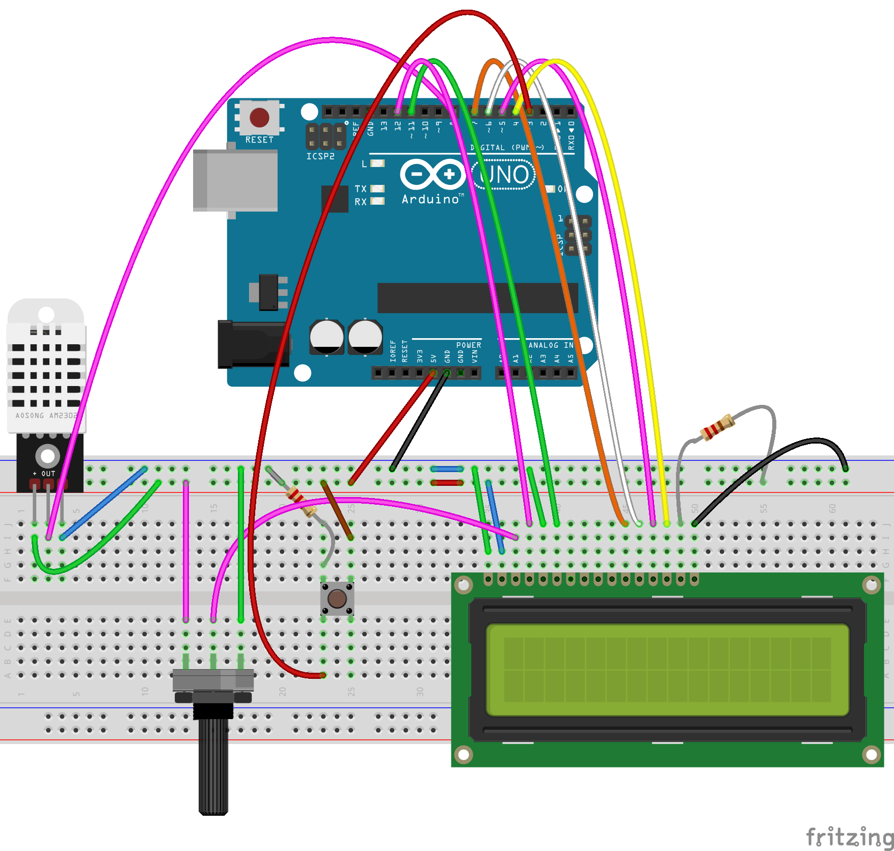

# DHT22 with LCD
This project uses a DHT22 sensor to measure temperature and humidity, and displays the results on an LCD screen.  
An Arduino board is used to read the sensor data and control the LCD display.

## Components
- Arduino board (e.g., Arduino Uno)
- DHT22 sensor
- LCD display (e.g., 16x2 LCD)
- Breadboard
- Jumper wires

## Wiring Diagram
